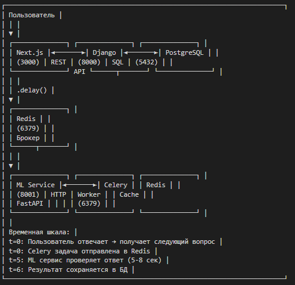

# Образовательный чат с асинхронной проверкой ответов

Платформа для проведения уроков с автоматической проверкой ответов через ML-сервис (имитация). Проект демонстрирует асинхронную обработку задач с использованием Celery и Redis, а также микросервисную архитектуру и варианты fullstack разработки с использованием Next.js и Django.
Содержание:
- Информация о проекте
- Команды для работы
- Схему архитектуры
- Инструкции по тестированию
- Диагностика проблем
- Примеры запросов к API

## Архитектура проекта



## Технологический стек

- Next.js 14
- Django 5.0
- ML Сервис (имитация LLM)
- Очередь задач Celery 5.3 (Асинхронная обработка)
- Брокер Redis 7 (Очереди и кэширование)
- PostgreSQL 15 (Хранение записей)

## Реализовано

1. **Асинхронная проверка ответов**
   - Ответы отправляются в Celery, пользователь не ждёт
   - ML сервис имитирует задержку LLM (5-8 секунд)
   - Результат сохраняется в БД без блокировки интерфейса

2. **Таймаут ответа (30 секунд)**
   - Если пользователь не ответил за 30 сек → отправляется пустой ответ
   - Запись помечается статусом `timeout`

3. **Отказоустойчивость ML сервиса**
   - В 1 случае из 3 возвращается ошибка 503 (рандомайзер)
   - Запись помечается статусом `error` с сохранением ошибки

4. **Полное логирование**
   - Все взаимодействия сохраняются в `interaction_records`
   - Фиксируются: вопрос, ответ, время, статус, ошибки
   - При закрытии урока данные не теряются

5. **UI индикаторы**

6. **Код покрыт тестами**


## Быстрый старт

### Требования

- Docker Desktop
- Docker Compose

### Установка и запуск

```bash
# 1. Клонировать репозиторий
git clone https://github.com/yourusername/educational-chat.git

# 2. Запустить все сервисы из папки с проектом
docker-compose up -d --build

# 3. Выполнить миграции БД
docker-compose exec backend python manage.py makemigrations
docker-compose exec backend python manage.py migrate
```

### Доступ к сервисам

- Frontend (Next.js)	http://localhost:3000	Интерфейс чата
- Backend (Django)	http://localhost:8000	Вариант с использованием джанго шаблонов + админка (если создать суперпользователя)
- ML Service API	    http://localhost:8001/docs	Swagger документация

### Управление и проверка

# Просмотр статуса контейнеров
```
docker-compose ps
```

# Просмотр логов всех сервисов
```
docker-compose logs -f
```

# Просмотр логов конкретного сервиса
```
docker-compose logs -f backend
docker-compose logs -f celery
docker-compose logs -f ml_service
```

# Просмотр записей в БД PostgreSQL
```
docker-compose exec postgres psql -U chatuser -d chatdb

\dt                                                     # Список таблиц
SELECT * FROM lessons_interactionrecord;                # Все записи
SELECT COUNT(*) FROM lessons_interactionrecord;         # Количество записей
```

# Просмотр записей через Django shell
```
docker-compose exec backend python manage.py shell
>>> from lessons.models import InteractionRecord
>>> InteractionRecord.objects.all().values('id', 'status', 'is_correct', 'user_answer')
``` 

# Запуск тестов
```
docker-compose exec backend python manage.py test --verbosity=2
```

### API endpoints

# Django API

- POST	/api/start-lesson/	Начать урок	{success, session_id, question, question_number, total_questions}
- POST	/api/submit-answer/	Отправить ответ	{success, next_question, next_question_number, is_last}
- GET	    /admin/	Django админка	HTML (если была создана)

# ML-service

- POST	/check_answer	Проверить ответ	{is_correct, processing_time} или ошибка 503
- GET	    /health	Health check	{status: "healthy"}
